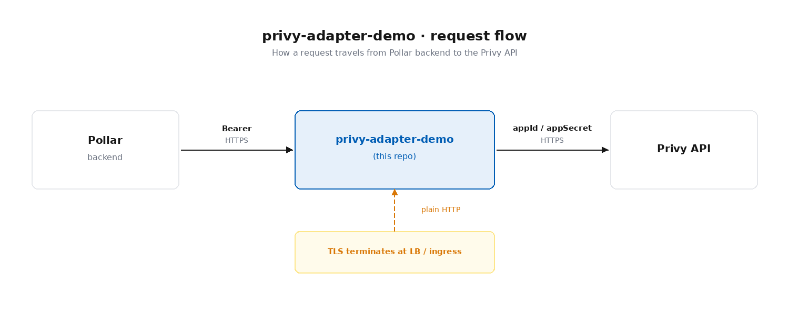

# privy-adapter-demo

Reference deployment of [`@pollar/privy-adapter`](https://www.npmjs.com/package/@pollar/privy-adapter) as a standalone HTTP service. The adapter proxies wallet operations (create / sign Stellar transactions / look up address) between Pollar's backend and Privy, using **this customer's** Privy credentials.

The Privy `APP_SECRET` never leaves this infrastructure — Pollar only ever sees a Bearer token issued by your team.

---

## Architecture



- **Stateless.** No DB, no persistent storage. Restart-safe.
- **Single concern.** Only the four adapter endpoints are exposed.
- **Independent lifecycle.** Runs as its own process / container, decoupled from any main app.

---

## Endpoints

The adapter exposes four endpoints. All responses share a standard JSON envelope.

**Success envelope (HTTP 2xx):**

```json
{
  "content": "<payload>",
  "code": "<PRIVY_ADAPTER_*>",
  "success": true
}
```

**Error envelope (HTTP 4xx / 5xx):**

```json
{
  "code": "<ERROR_CODE>",
  "success": false
}
```

Some error responses include extra fields (e.g. `issues` for validation failures, `reason` for upstream errors).

**Authentication.** All `/wallets/*` routes require `Authorization: Bearer <POLLAR_API_SECRET>`. A missing or wrong token returns `401 FORBIDDEN`. `GET /health` is public.

**Body limit.** Requests whose JSON body exceeds `maxBodyBytes` (default `64 KiB`) return `413 VALIDATION_ERROR` with `reason: "body too large"`.

**Quick reference:**

| Method | Path                          | Auth   | Request body                                  | Success payload          |
| ------ | ----------------------------- | ------ | --------------------------------------------- | ------------------------ |
| GET    | `/health`                     | none   | —                                             | `{ ok, timestamp }`      |
| POST   | `/wallets/create`             | Bearer | `{ userId }`                                  | `{ address }`            |
| POST   | `/wallets/sign`               | Bearer | `{ userId, walletAddress, txXdr }`            | `{ signedTxXdr }`        |
| GET    | `/wallets/:userId/address`    | Bearer | —                                             | `{ address }`            |

---

### GET /health

Liveness / connectivity probe. No authentication. Used by Pollar's "Test connection" button and by container orchestrators (Docker `HEALTHCHECK`, k8s readiness/liveness probes).

**Request**

| Aspect | Value |
| ------ | ----- |
| Method | `GET` |
| Path   | `/health` |
| Auth   | none |
| Body   | — |

**Responses**

| Status | `code`                       | Body |
| ------ | ---------------------------- | ---- |
| `200`  | `PRIVY_ADAPTER_HEALTH_OK`    | `{ "content": { "ok": true, "timestamp": 1715200000000 }, "code": "PRIVY_ADAPTER_HEALTH_OK", "success": true }` |

**Example**

```bash
curl -s http://localhost:3001/health
```

---

### POST /wallets/create

Idempotently creates a Stellar wallet for a Privy user. If the user already has one, it's returned with the `PRIVY_ADAPTER_WALLET_EXISTS` code (HTTP `200`) rather than creating a duplicate.

**Request**

| Aspect       | Value                                       |
| ------------ | ------------------------------------------- |
| Method       | `POST`                                      |
| Path         | `/wallets/create`                           |
| Auth         | `Authorization: Bearer <POLLAR_API_SECRET>` |
| Content-Type | `application/json`                          |

**Body**

| Field    | Type   | Required | Notes                                       |
| -------- | ------ | -------- | ------------------------------------------- |
| `userId` | string | yes      | Privy user DID, e.g. `did:privy:abc123`. Min length 1. |

```json
{ "userId": "did:privy:abc123" }
```

**Responses**

| Status | `code`                          | When                              | Body                                                                                       |
| ------ | ------------------------------- | --------------------------------- | ------------------------------------------------------------------------------------------ |
| `201`  | `PRIVY_ADAPTER_WALLET_CREATED`  | New wallet provisioned            | `{ "content": { "address": "G..." }, "code": "PRIVY_ADAPTER_WALLET_CREATED", "success": true }` |
| `200`  | `PRIVY_ADAPTER_WALLET_EXISTS`   | User already had a Stellar wallet | `{ "content": { "address": "G..." }, "code": "PRIVY_ADAPTER_WALLET_EXISTS", "success": true }`  |
| `400`  | `VALIDATION_ERROR`              | Body fails schema                 | `{ "code": "VALIDATION_ERROR", "success": false, "issues": [ ... ] }`                      |
| `401`  | `FORBIDDEN`                     | Missing or invalid Bearer         | `{ "code": "FORBIDDEN", "success": false }`                                                |
| `413`  | `VALIDATION_ERROR`              | Body > `maxBodyBytes`             | `{ "code": "VALIDATION_ERROR", "success": false, "reason": "body too large" }`             |
| `502`  | `WALLET_CREATION_FAILED`        | Privy upstream error              | `{ "code": "WALLET_CREATION_FAILED", "success": false, "reason": "<message>" }`            |

**Example**

```bash
curl -s -X POST http://localhost:3001/wallets/create \
  -H "Authorization: Bearer $POLLAR_API_SECRET" \
  -H 'Content-Type: application/json' \
  -d '{"userId":"did:privy:abc123"}'
```

---

### POST /wallets/sign

Signs a Stellar transaction with the user's wallet. The adapter parses the XDR, computes the transaction hash, asks Privy to raw-sign it (Tier 2 / Ed25519), assembles a `DecoratedSignature`, and returns the signed XDR.

> The adapter does **not** submit the transaction to the Stellar network — that's the caller's responsibility.

**Request**

| Aspect       | Value                                       |
| ------------ | ------------------------------------------- |
| Method       | `POST`                                      |
| Path         | `/wallets/sign`                             |
| Auth         | `Authorization: Bearer <POLLAR_API_SECRET>` |
| Content-Type | `application/json`                          |

**Body**

| Field           | Type   | Required | Notes                                                          |
| --------------- | ------ | -------- | -------------------------------------------------------------- |
| `userId`        | string | yes      | Privy user DID. Min length 1.                                  |
| `walletAddress` | string | yes      | Stellar `G…` address of the signing wallet. Min length 1.      |
| `txXdr`         | string | yes      | Base64-encoded unsigned Stellar transaction XDR. Min length 1. |

```json
{
  "userId": "did:privy:abc123",
  "walletAddress": "GA7QYNF7SOWQ3GLR2BGMZEHXAVIRZA4KVWLTJJFC7MGXUA74P7UJVSGZ",
  "txXdr": "AAAAAgAAAAB..."
}
```

**Responses**

| Status | `code`                    | When                              | Body                                                                                |
| ------ | ------------------------- | --------------------------------- | ----------------------------------------------------------------------------------- |
| `200`  | `PRIVY_ADAPTER_TX_SIGNED` | Transaction signed                | `{ "content": { "signedTxXdr": "AAAA..." }, "code": "PRIVY_ADAPTER_TX_SIGNED", "success": true }` |
| `400`  | `VALIDATION_ERROR`        | Body fails schema                 | `{ "code": "VALIDATION_ERROR", "success": false, "issues": [ ... ] }`               |
| `400`  | `TX_INVALID_SIGNED_XDR`   | `txXdr` could not be parsed       | `{ "code": "TX_INVALID_SIGNED_XDR", "success": false }`                             |
| `401`  | `FORBIDDEN`               | Missing or invalid Bearer         | `{ "code": "FORBIDDEN", "success": false }`                                         |
| `404`  | `WALLET_NOT_FOUND`        | `walletAddress` not owned by user | `{ "code": "WALLET_NOT_FOUND", "success": false }`                                  |
| `413`  | `VALIDATION_ERROR`        | Body > `maxBodyBytes`             | `{ "code": "VALIDATION_ERROR", "success": false, "reason": "body too large" }`      |
| `502`  | `TX_SUBMIT_FAILED`        | Privy signing call failed         | `{ "code": "TX_SUBMIT_FAILED", "success": false, "reason": "<message>" }`           |

**Example**

```bash
curl -s -X POST http://localhost:3001/wallets/sign \
  -H "Authorization: Bearer $POLLAR_API_SECRET" \
  -H 'Content-Type: application/json' \
  -d '{
    "userId": "did:privy:abc123",
    "walletAddress": "GA7QYNF7SOWQ3GLR2BGMZEHXAVIRZA4KVWLTJJFC7MGXUA74P7UJVSGZ",
    "txXdr": "AAAAAgAAAAB..."
  }'
```

---

### GET /wallets/:userId/address

Returns the Stellar address for a user's existing wallet. Read-only — never creates a wallet.

**Request**

| Aspect | Value                                       |
| ------ | ------------------------------------------- |
| Method | `GET`                                       |
| Path   | `/wallets/:userId/address`                  |
| Auth   | `Authorization: Bearer <POLLAR_API_SECRET>` |
| Body   | —                                           |

**Path params**

| Param    | Type   | Notes                                                                  |
| -------- | ------ | ---------------------------------------------------------------------- |
| `userId` | string | Privy user DID. URL-encode if it contains characters like `:` or `/`.  |

**Responses**

| Status | `code`                          | When                         | Body                                                                                                |
| ------ | ------------------------------- | ---------------------------- | --------------------------------------------------------------------------------------------------- |
| `200`  | `PRIVY_ADAPTER_WALLET_ADDRESS`  | Wallet found                 | `{ "content": { "address": "G..." }, "code": "PRIVY_ADAPTER_WALLET_ADDRESS", "success": true }`     |
| `400`  | `VALIDATION_ERROR`              | Empty `userId` path param    | `{ "code": "VALIDATION_ERROR", "success": false }`                                                  |
| `401`  | `FORBIDDEN`                     | Missing or invalid Bearer    | `{ "code": "FORBIDDEN", "success": false }`                                                         |
| `404`  | `WALLET_NOT_FOUND`              | User has no Stellar wallet   | `{ "code": "WALLET_NOT_FOUND", "success": false }`                                                  |
| `500`  | `INTERNAL_SERVER_ERROR`         | Unexpected error             | `{ "code": "INTERNAL_SERVER_ERROR", "success": false }`                                             |

**Example**

```bash
curl -s http://localhost:3001/wallets/did%3Aprivy%3Aabc123/address \
  -H "Authorization: Bearer $POLLAR_API_SECRET"
```

---

### Code reference

**Success codes** (used in the success envelope's `code` field):

| Code                              | Emitted by                       | Meaning                                |
| --------------------------------- | -------------------------------- | -------------------------------------- |
| `PRIVY_ADAPTER_HEALTH_OK`         | `GET /health`                    | Adapter is up                          |
| `PRIVY_ADAPTER_WALLET_CREATED`    | `POST /wallets/create`           | New wallet provisioned (HTTP `201`)    |
| `PRIVY_ADAPTER_WALLET_EXISTS`     | `POST /wallets/create`           | Wallet already existed (HTTP `200`)    |
| `PRIVY_ADAPTER_WALLET_ADDRESS`    | `GET /wallets/:userId/address`   | Address lookup succeeded               |
| `PRIVY_ADAPTER_TX_SIGNED`         | `POST /wallets/sign`             | Transaction signed                     |

**Error codes** (used in the error envelope's `code` field):

| Code                       | Typical status | Meaning                                                       |
| -------------------------- | -------------- | ------------------------------------------------------------- |
| `VALIDATION_ERROR`         | `400` / `413`  | Body fails schema, missing field, or body too large           |
| `FORBIDDEN`                | `401`          | Missing or invalid Bearer                                     |
| `WALLET_NOT_FOUND`         | `404`          | No Stellar wallet for the given user / address                |
| `WALLET_CREATION_FAILED`   | `502`          | Upstream Privy error while creating the wallet                |
| `TX_INVALID_SIGNED_XDR`    | `400`          | Transaction XDR could not be parsed                           |
| `TX_SUBMIT_FAILED`         | `502`          | Upstream Privy error while signing                            |
| `INTERNAL_SERVER_ERROR`    | `500`          | Unexpected adapter error                                      |

---

## Prerequisites

- **Node.js ≥ 20**
- **pnpm ≥ 9** (managed via `corepack`)
- A **Privy app** (App ID + App Secret) for the customer
- A **Pollar API Secret** — generated once by your team (≥ 32 random bytes), registered in the Pollar dashboard

Generate a `POLLAR_API_SECRET` locally:

```bash
openssl rand -hex 32
```

---

## Configuration

All configuration is read from environment variables (loaded from `.env` in development via `dotenv`). The schema is validated by zod at startup — missing or invalid values cause the process to exit with a clear error.

| Variable             | Required | Default    | Description                                                                 |
| -------------------- | -------- | ---------- | --------------------------------------------------------------------------- |
| `PRIVY_APP_ID`       | yes      | —          | Privy App ID from the customer's Privy dashboard.                           |
| `PRIVY_APP_SECRET`   | yes      | —          | Privy App Secret. Never leaves this infrastructure.                         |
| `POLLAR_API_SECRET`  | yes      | —          | Bearer token Pollar uses to call this adapter. Min 32 chars.                |
| `STELLAR_NETWORK`    | yes      | —          | `mainnet` or `testnet`. Must match what's registered in the Pollar dashboard. |
| `ADAPTER_PORT`       | no       | `3001`     | Port to listen on. Plain HTTP — terminate TLS upstream.                     |
| `LOG_LEVEL`          | no       | `info`     | `fatal` \| `error` \| `warn` \| `info` \| `debug` \| `trace`.               |

Copy the template to get started:

```bash
cp .env.example .env
# then fill in PRIVY_APP_ID, PRIVY_APP_SECRET, POLLAR_API_SECRET, STELLAR_NETWORK
```

---

## Getting started

### 1. Install

```bash
pnpm install
```

> **Note:** This demo links `@pollar/privy-adapter` via [yalc](https://github.com/wclr/yalc) (`file:.yalc/@pollar/privy-adapter` in `package.json`). The `.yalc/` directory is committed-out via `.gitignore`; keep your local copy in sync with `yalc add @pollar/privy-adapter` against your local checkout of the package.

### 2. Configure

```bash
cp .env.example .env
# edit .env with real values
```

### 3. Run in development

```bash
pnpm adapter:dev
```

`tsx watch` reloads on source changes. You should see:

```
{"level":30,"service":"privy-adapter","port":3001,"network":"testnet","msg":"privy-adapter listening"}
```

### 4. Build & run for production

```bash
pnpm build         # tsc → dist/
pnpm adapter:start # node dist/adapter-server.js
```

### 5. Typecheck

```bash
pnpm typecheck
```

---

## Smoke tests

With the adapter running on `:3001`:

```bash
# Health (no auth) — must return 200
curl -s http://localhost:3001/health | jq

# Auth check — must return 401 with { code: "FORBIDDEN", success: false }
curl -s -X POST http://localhost:3001/wallets/create \
  -H 'Content-Type: application/json' \
  -d '{"userId":"x"}' | jq

# Real create — replace with a real Privy DID
curl -s -X POST http://localhost:3001/wallets/create \
  -H "Authorization: Bearer $POLLAR_API_SECRET" \
  -H 'Content-Type: application/json' \
  -d '{"userId":"did:privy:abc123"}' | jq

# Address lookup
curl -s http://localhost:3001/wallets/did:privy:abc123/address \
  -H "Authorization: Bearer $POLLAR_API_SECRET" | jq
```

---

## Docker

A multi-stage `Dockerfile.adapter` is provided. It bundles the yalc-linked package into the image so the `file:` dependency resolves at build time.

```bash
docker build -f Dockerfile.adapter -t privy-adapter-demo .

docker run --rm -p 3001:3001 \
  -e PRIVY_APP_ID=… \
  -e PRIVY_APP_SECRET=… \
  -e POLLAR_API_SECRET=… \
  -e STELLAR_NETWORK=testnet \
  privy-adapter-demo
```

The image includes a `HEALTHCHECK` against `GET /health`.

---

## Deployment checklist

- [ ] **Secrets** injected via your secret manager (`PRIVY_APP_ID`, `PRIVY_APP_SECRET`, `POLLAR_API_SECRET`, `STELLAR_NETWORK`).
- [ ] **TLS** terminates at the load balancer / ingress; the adapter listens on plain HTTP.
- [ ] **Egress** allowlist includes `https://api.privy.io`.
- [ ] **Ingress** restricted to Pollar's egress CIDR list once published.
- [ ] **Readiness/liveness** probes pointed at `GET /health`.
- [ ] **Adapter URL** + `POLLAR_API_SECRET` registered in the Pollar dashboard for this customer's application.
- [ ] **Network** value in the dashboard matches `STELLAR_NETWORK` here.
- [ ] **"Test connection"** in the Pollar dashboard succeeds (Pollar hits `GET /health`).

---

## Acceptance criteria

- `GET /health` returns the standard envelope and `200`.
- Missing or wrong Bearer → `401` with `{ code: "FORBIDDEN", success: false }`.
- A real `POST /wallets/create` produces a wallet visible in the Privy dashboard.
- Container restarts cleanly on `SIGTERM` (no orphaned ports).
- Rotating `PRIVY_APP_SECRET` in the secret manager is picked up automatically within `cacheTtlMs` (5 min default) — no redeploy required.
- Errors flow through `pino` via `onError`, with no plaintext secrets in the log payload.

> **Note on rotation in the demo:** `getCredentials` reads from `config`, which snapshots `process.env` at boot via `dotenv`. To exercise rotation locally you need to swap `getCredentials` for a function that re-reads its source on each call (e.g. an AWS Secrets Manager fetch — see the spec for a sample implementation).

---

## Project layout

```
.
├── .env.example          # template for local config
├── .yalc/                # locally-linked @pollar/privy-adapter (gitignored)
├── Dockerfile.adapter    # multi-stage pnpm + corepack, healthcheck on /health
├── package.json          # scripts: adapter:dev, adapter:start, build, typecheck
├── tsconfig.json         # CommonJS, strict, target ES2022
└── src/
    ├── adapter-server.ts # entry point — start, log, SIGTERM/SIGINT shutdown
    ├── adapter.ts        # createPollarPrivyAdapter wired with config + logger
    ├── config.ts         # dotenv + zod schema validation
    └── logger.ts         # pino with service:'privy-adapter' base
```

---

## Out of scope

- Modifying `@pollar/privy-adapter` source.
- Persisting any state (no DB writes — the adapter is intentionally stateless).
- Routing other application traffic through this service.

---

## Troubleshooting

**`[config] invalid environment` at startup**
A required env var is missing or fails validation. The error payload lists the offending fields. Check `.env` against `.env.example`.

**`pnpm install` fails to resolve `@pollar/privy-adapter`**
Make sure `.yalc/@pollar/privy-adapter/package.json` exists. Re-link with `yalc add @pollar/privy-adapter` from this repo's root after publishing locally with `yalc publish` from the package repo.

**Pollar's "Test connection" fails**
Verify the registered URL is HTTPS (TLS-terminated upstream), publicly reachable, and that `GET /health` returns 200 from outside your network.

**`401 FORBIDDEN` on every request from Pollar**
The `POLLAR_API_SECRET` value configured here must exactly match the secret registered in the Pollar dashboard for this customer.
